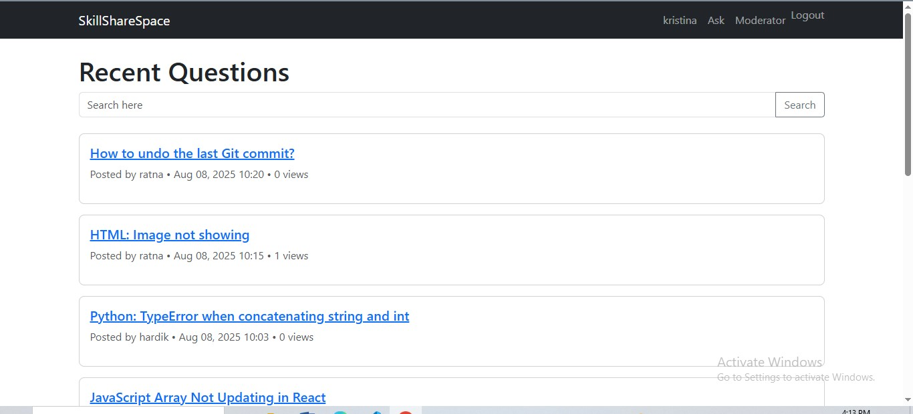
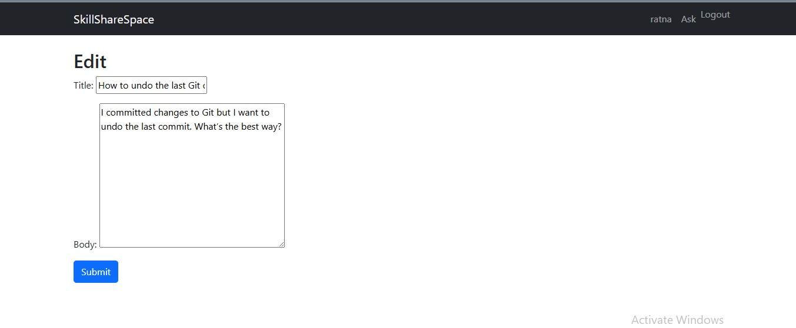

# SkillShareSpace

SkillShareSpace is a minimalist Django-based Question & Answer platform inspired by StackOverflow, designed for small communities.  
It supports user roles, content approval, flagging, and a simple moderation dashboard.

---

## 🚀 Features
1.**User Authentication**
  - Signup, Login, Logout using Django's built-in auth system.
2. **Questions & Answers**
  - Create, edit, delete your own posts.
  - Approval workflow — visible to public only after moderator approval.
  - View counts for questions.
3. **Moderation Dashboard**
  - View unapproved posts.
  - Approve/Dismiss flagged content.
  - Quick moderation actions.
4.**Flagging System**
  - Flag inappropriate questions or answers.
  - Moderators can review and take action.
5.**Search**
  - Simple keyword-based search for questions.
6. **UI**
  - Bootstrap-based minimal design.
  - Conditional moderator controls.


---

## 📸 Screenshots
## 📸 Screenshots

### Home Page 


### Not logged in users view


### Login Page


### Signup Page


### Moderator Dashboard




### Logged-in User View





---

## ⚙️ Setup & Run Instructions

### 1️⃣ Clone the repository
```bash
git clone https://github.com/<your-username>/skillsharespace.git
cd skillsharespace
```

### 2️⃣ Create and activate a virtual environment
```bash
python -m venv venv
# Windows
venv\Scripts\activate
# Mac/Linux
source venv/bin/activate
```

### 3️⃣ Install dependencies
```bash
pip install -r requirements.txt
```

### 4️⃣ Apply migrations
```bash
python manage.py migrate
```

### 5️⃣ Create a superuser (for moderator role)
```bash
python manage.py createsuperuser
```

### 6️⃣ Run the development server
```bash
python manage.py runserver
```

### 7️⃣ Access the application
- Main site: http://127.0.0.1:8000/
- Admin dashboard: http://127.0.0.1:8000/admin/

---

## 👥 Roles & Credentials

**Regular User**
- Can create, edit, and delete their own questions/answers.
- Can flag inappropriate content.
- Can search and view only approved content.

**Moderator**
- Can approve or reject questions and answers.
- Can view and dismiss flagged content.
- Has access to the moderation dashboard.

**Example Test Credentials (if you load sample data)**
```
Moderator:  username: moderator1 | password: pass1234
User:       username: user1      | password: pass1234
```

---

## 🛠 Design Decisions

1. **Class-Based Views (CBVs)**
   - All views implemented as CBVs for cleaner, reusable, and organized code.

2. **Approval Workflow**
   - New posts are hidden from public view until approved by a moderator.
   - Implemented via a boolean `approved` field in models.

3. **Flagging System**
   - Built using a generic relation (`content_type` + `object_id`) so both questions and answers can be flagged.

4. **Minimal UI**
   - Used Bootstrap for simplicity, responsiveness, and consistent styling.

5. **Search**
   - Implemented with Django ORM filtering — no external dependencies required.

6. **View Count Tracking**
   - Each time a question is viewed, a counter is incremented in the detail view.

---

## 📜 License
MIT License — feel free to use and modify for your own projects.
